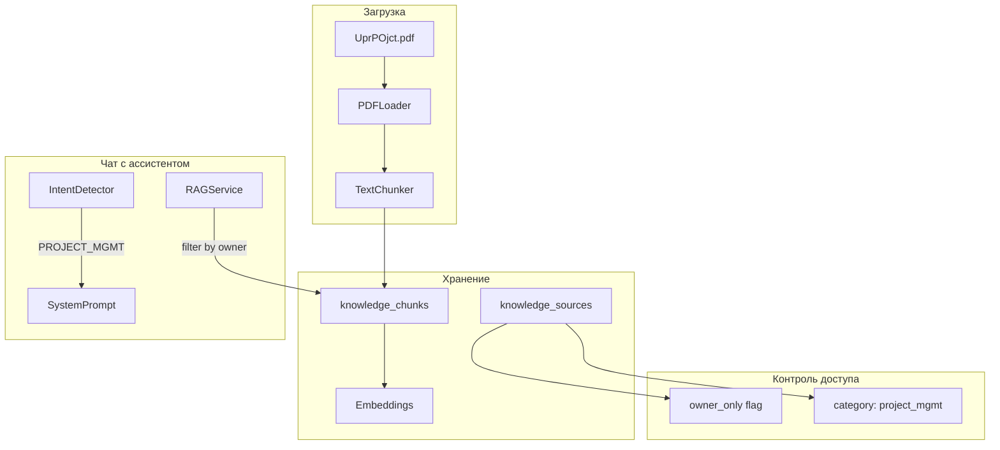

# Интеграция методологии управления проектами в VILI

## Архитектура решения



## 1. Расширение схемы БД

Добавить поле `category` и улучшить контроль доступа в [init.sql](backend/init.sql):

```sql
-- Добавить категорию и флаг owner_only
ALTER TABLE knowledge_sources 
ADD COLUMN IF NOT EXISTS category VARCHAR(100),
ADD COLUMN IF NOT EXISTS owner_only BOOLEAN DEFAULT false;

CREATE INDEX IF NOT EXISTS idx_knowledge_sources_category 
ON knowledge_sources(category);
```

## 2. Обновление моделей

- [knowledge_source.py](backend/app/database/schemas/knowledge_source.py) - добавить `category` и `owner_only` в схемы
- Обновить `KnowledgeSourceCreate`, `KnowledgeSourceResponse`

## 3. Фильтрация RAG по владельцу

Модифицировать [rag_service.py](backend/app/services/rag_service.py):

```python
async def search_knowledge(
    self,
    query: str,
    user_id: Optional[UUID] = None,  # Новый параметр
    include_owner_only: bool = False,  # Включать owner_only контент
    ...
)
```

Обновить SQL-функцию `search_similar_knowledge` для фильтрации по `created_by` и `owner_only`.

## 4. Новый Intent для управления проектами

Добавить в [intent_detector.py](backend/app/services/intent_detector.py):

```python
IntentPattern(
    intent=IntentType.PROJECT_MANAGEMENT,
    keywords=["проект", "план", "этап", "milestone", "задач", "риск проекта", 
              "управлени", "методолог", "agile", "waterfall", "scrum"],
    priority=8
)
```

Добавить `PROJECT_MANAGEMENT` в `IntentType` enum.

## 5. Специализированный системный промпт

Создать промпт-шаблон для контекста управления проектами:

```python
PROJECT_MGMT_SYSTEM_PROMPT = """Ты - эксперт по управлению проектами.
Опирайся на методологию из базы знаний при ответах.
Структурируй рекомендации по этапам: инициация, планирование, 
исполнение, мониторинг, завершение.
Предлагай конкретные инструменты и шаблоны из документации."""
```

## 6. API для загрузки с категорией

Расширить эндпоинт [knowledge_sources.py](backend/app/api/v1/knowledge_sources.py):

```python
@router.post("/upload")
async def upload_knowledge_source(
    name: str = Form(...),
    file: UploadFile = File(...),
    category: Optional[str] = Form(None),  # Новое
    owner_only: bool = Form(False),         # Новое
    ...
)
```

## 7. Загрузка PDF

После реализации - загрузить документ:

```bash
curl -X POST "http://localhost:8000/api/v1/knowledge_sources/upload" \
  -H "Authorization: Bearer <owner_token>" \
  -F "name=Методология управления проектами" \
  -F "category=project_management" \
  -F "owner_only=true" \
  -F "description=Руководство по управлению проектами для бизнеса" \
  -F "file=@UprPOjct.pdf"
```

## Ключевые файлы для изменения

- `backend/init.sql` - миграция БД
- `backend/app/database/schemas/knowledge_source.py` - схемы
- `backend/app/database/schemas/intent.py` - IntentType enum
- `backend/app/services/rag_service.py` - фильтрация по владельцу
- `backend/app/services/intent_detector.py` - паттерн PROJECT_MANAGEMENT
- `backend/app/api/v1/knowledge_sources.py` - расширение API
- `backend/app/api/v1/chat.py` - обработчик для PROJECT_MANAGEMENT intent

## Статус выполнения

✅ Все задачи выполнены:
- ✅ Расширение схемы БД
- ✅ Обновление моделей и схем
- ✅ Фильтрация RAG по владельцу
- ✅ Добавление IntentType.PROJECT_MANAGEMENT
- ✅ Паттерн распознавания
- ✅ Специализированный промпт
- ✅ Расширение API
- ✅ Скрипты для загрузки PDF

## Дополнительно созданные файлы

- `upload_project_methodology.sh` - bash скрипт для загрузки
- `upload_project_methodology.py` - Python скрипт для загрузки
