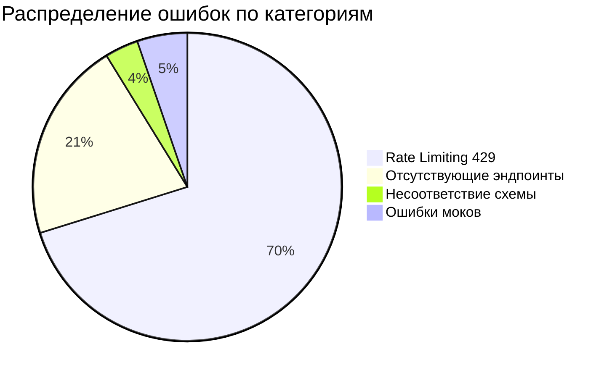

# План исправления интеграционных тестов до 100%

## Анализ проблем

Из 57 провалившихся тестов выявлены 4 категории проблем:



---

## Категория 1: Rate Limiting (429 Too Many Requests)

**Затронуто:** ~40 тестов (все test_api_operators.py, test_api_risk.py, большая часть других)

**Причина:** Middleware `RateLimitMiddleware` в [backend/app/core/middleware.py](backend/app/core/middleware.py) ограничивает 60 запросов/минуту. При запуске 244 тестов лимит исчерпывается.

**Решение:** Отключить rate limiting при `TESTING=true`

В [backend/app/main.py](backend/app/main.py) добавить условие:

```python
if not os.getenv("TESTING"):
    app.add_middleware(RateLimitMiddleware, ...)
```

---

## Категория 2: Отсутствующие API эндпоинты (404, 405, 422)

### 2.1 Documents API - 4 теста

**Проблема:** Тесты вызывают `POST /api/v1/documents/analyze`, но такой эндпоинт не существует. В [backend/app/api/v1/documents.py](backend/app/api/v1/documents.py) есть только `POST /{document_id}/analyze`.

**Решение вариант A (предпочтительно):** Обновить тесты в [backend/tests/integration/test_api_documents.py](backend/tests/integration/test_api_documents.py):

- Заменить `POST /api/v1/documents/analyze` на `POST /api/v1/documents/upload` + `POST /api/v1/documents/{id}/analyze`

**Решение вариант B:** Добавить новый эндпоинт `POST /api/v1/documents/analyze` для прямого анализа без загрузки.

### 2.2 Feedback API - 5 тестов

**Проблема:** Тесты ожидают `GET /api/v1/feedback` для списка, но в [backend/app/api/v1/feedback.py](backend/app/api/v1/feedback.py) только:

- `POST /` - создание
- `GET /{document_id}` - по документу

**Решение:** Добавить в feedback.py:

```python
@router.get("/")
async def list_feedback(...):
    ...

@router.get("/{feedback_id}")  # UUID feedback, не document_id
async def get_feedback_by_id(...):
    ...
```

### 2.3 Compliance API - 5 тестов

**Проблема:** Тесты ожидают:

- `GET /api/v1/compliance/checks` - списoк проверок
- `GET /api/v1/compliance/checks/{check_id}` - отдельная проверка
- `GET /api/v1/compliance/rules` - список правил

Но в [backend/app/api/v1/compliance.py](backend/app/api/v1/compliance.py) есть только:

- `POST /check`
- `GET /statistics`
- `GET /{document_id}`

**Решение:** Добавить в compliance.py:

```python
@router.get("/checks")
async def list_checks(document_id: Optional[UUID] = None, status: Optional[str] = None, ...):
    ...

@router.get("/checks/{check_id}")
async def get_check_by_id(check_id: UUID, ...):
    ...

@router.get("/rules")
async def list_rules():
    ...
```

---

## Категория 3: Несоответствие схемы ответа

### 3.1 Health API - 2 теста

**Проблема:**

- `test_health_check_returns_services` ожидает поле `services` в `/api/v1/health`
- Но текущий `/health` возвращает `{status, version, service}`, а `services` есть в `/health/detailed`

**Решение:** Обновить [backend/tests/integration/test_api_health.py](backend/tests/integration/test_api_health.py):

- Либо убрать ожидание `services` из test_health_check_returns_services
- Либо использовать `/api/v1/health/detailed` для этого теста

---

## Категория 4: Ошибки моков

### 4.1 test_analyze_document_with_llm_mock - 1 тест

**Проблема:** Тест пытается пропатчить `app.api.v1.documents.llm_service`, но LLMService создаётся внутри функции (строка 54, 128), а не как глобальная переменная.

**Решение:** Изменить мок в тесте на:

```python
with patch('app.api.v1.documents.LLMService') as mock_cls:
    mock_cls.return_value = mock_llm_service
    ...
```

---

## Файлы для изменения

| Файл | Изменения |

|------|-----------|

| `backend/app/main.py` | Условное отключение RateLimitMiddleware для TESTING |

| `backend/app/api/v1/compliance.py` | Добавить `/checks`, `/checks/{id}`, `/rules` |

| `backend/app/api/v1/feedback.py` | Добавить `GET /` и `GET /{feedback_id}` |

| `backend/tests/integration/test_api_documents.py` | Исправить URL и мок LLMService |

| `backend/tests/integration/test_api_health.py` | Исправить ожидания для schema |

| `backend/tests/integration/test_api_feedback.py` | Обновить схему feedback request |

---

## Порядок выполнения

1. **Сначала** исправить rate limiting - это разблокирует 40 тестов
2. **Затем** добавить недостающие эндпоинты в API
3. **Далее** исправить тесты с неверными ожиданиями
4. **В конце** запустить полный тестовый прогон для верификации
